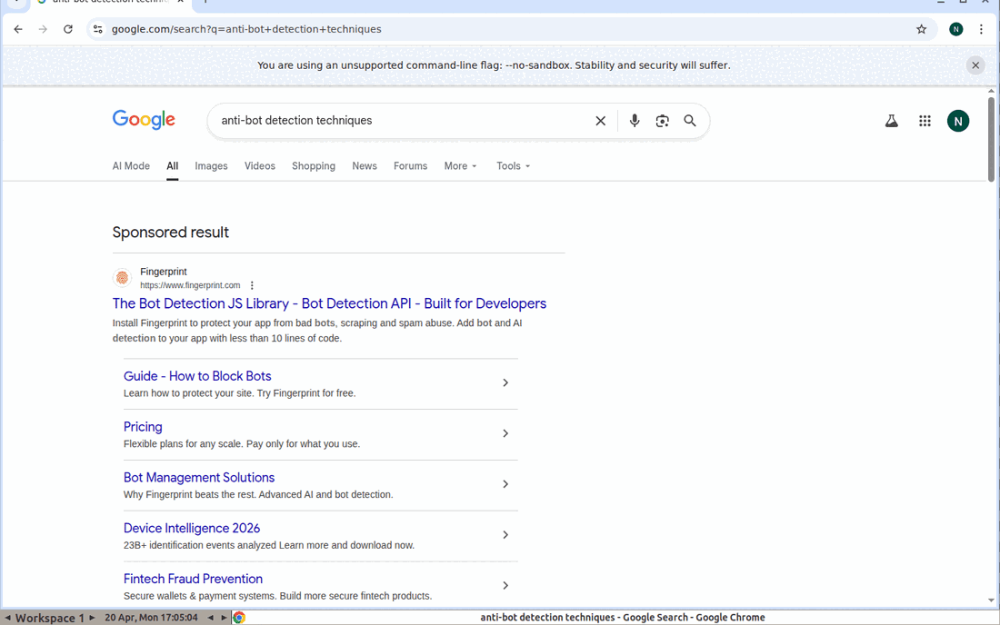
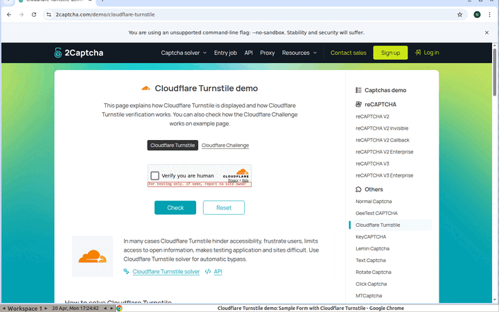
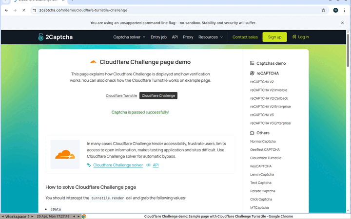
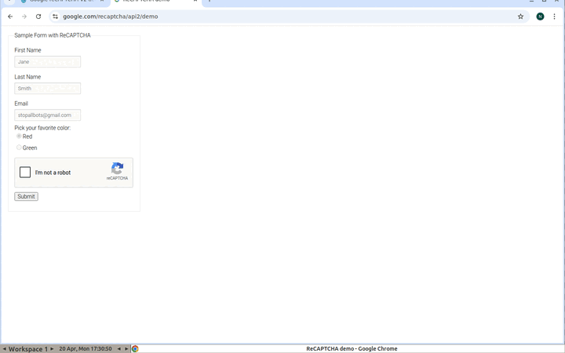

# hermes-computer-use

[](https://github.com/Noah3521/hermes-computer-use/actions/workflows/ci.yml)
[](https://pypi.org/project/hermes-computer-use/)
[](LICENSE)
[](https://www.python.org/)
[](docs/WSL_SETUP.md)

> **Scope: Windows 11 + WSL2 Ubuntu 22.04 / 24.04 only.** This project intentionally limits its support matrix — native Linux / macOS / Windows are not targets. See [docs/WSL_SETUP.md](docs/WSL_SETUP.md) for why and for the full setup walkthrough.

**Pixel-level browser automation MCP server.** Gives any MCP-speaking agent (hermes-agent, Claude Code, Codex, …) 21 tools to drive a real Chrome browser running in an Xvfb display: screenshots as vision input, OS-level mouse/keyboard as output. No CDP. No `navigator.webdriver`. No DOM shortcuts.

<p align="center"></p>

> **The agent-driven Chrome here is searching Google for `anti-bot detection techniques` — and Google serves a normal SERP. The top sponsored result is ironically an ad for bot-detection software.**

### Live captcha runs (actual recordings from this stack)

<table>
<tr>
<td align="center"><a href="docs/assets/demo-turnstile.gif"></a><br><sub><b>Cloudflare Turnstile</b><br>✅ clicked → "Success!"</sub></td>
<td align="center"><a href="docs/assets/demo-cf-challenge.gif"></a><br><sub><b>Cloudflare Challenge</b><br>✅ passive pass, zero clicks</sub></td>
<td align="center"><a href="docs/assets/demo-recaptcha.gif"></a><br><sub><b>reCAPTCHA v2</b><br>🟡 click accepted → image challenge (cold profile)</sub></td>
</tr>
</table>

> All three GIFs are unedited captures from the running stack. See [docs/CAPTCHA.md](docs/CAPTCHA.md) for the full capability matrix, including why reCAPTCHA escalates on cold profiles and how to reach silent pass. Also:
> - [`docs/assets/demo-sannysoft.png`](docs/assets/demo-sannysoft.png) — [bot.sannysoft.com](https://bot.sannysoft.com) fingerprint panel with WebDriver / Chrome / Permissions / Plugins / Languages / PHANTOM all **passed**. The only red cell is WebGL (side effect of `--disable-gpu`).

Think of it as the Linux-side reproduction of Anthropic's `computer-use-demo` — but exposed over stdio MCP so you can pair it with any agent runtime and any vision-capable model.

```
agent ── stdio MCP ──▶ hermes_computer_use.server ── subprocess ──▶ xdotool / scrot
                                                                          │
                                                                          ▼
                                                                      Xvfb :99
                                                                          │
                                                          ┌───────────────┴────────────────┐
                                                          ▼                                ▼
                                                    x11vnc :5900              websockify + noVNC :6080
                                                (native VNC clients)            (browser viewer)
```

See [docs/ARCHITECTURE.md](docs/ARCHITECTURE.md) for the longer version.

## Why

| | Playwright / CDP | hermes-computer-use |
|---|---|---|
| `navigator.webdriver` | `true` (detectable) | `undefined` |
| CDP endpoint | open | none |
| DOM access | direct (fast, brittle to markup changes) | screenshot only (slower, resilient to selector renames) |
| Anti-bot footprint | large, constantly patched | near-zero: stock Chrome, stock X11 input |
| Best for | reliable flows on sites *you own* | agents operating *unfamiliar* sites like a human |

If your automation has to walk a login funnel on a site with Cloudflare, Kasada, or reCAPTCHA sprinkled on it, this stack usually passes where Playwright gets stopped — because the browser is indistinguishable from a stock Chrome driven by a stock X server.

## Install

**Prerequisites (Windows host):** Windows 11, [WSL2](https://learn.microsoft.com/en-us/windows/wsl/install) with an Ubuntu 22.04 or 24.04 distro, and [systemd enabled in WSL](docs/WSL_SETUP.md#1-enable-systemd). Full walkthrough in [docs/WSL_SETUP.md](docs/WSL_SETUP.md).

Everything below runs **inside the WSL shell**, not in PowerShell.

### Option A — from PyPI (recommended once published)

```bash
pip install hermes-computer-use[novnc]
hermes-computer-use --help      # confirms the console script is on PATH
```

You still need the system packages (Xvfb, Chrome, xdotool, …) and the systemd units — see **Option B step 1 & 4** below.

### Option B — from source

```bash
git clone https://github.com/Noah3521/hermes-computer-use.git ~/hermes-computer-use
cd ~/hermes-computer-use

# 1. System packages (sudo): Xvfb, fluxbox, x11vnc, xdotool, ydotool, scrot,
#    ImageMagick, CJK fonts, Google Chrome, plus uinput if available.
bash scripts/setup.sh

# 2. Python package
python3 -m venv .venv
. .venv/bin/activate
pip install -e ".[novnc]"       # omit [novnc] if you don't want the web viewer

# 3. Optional browser-based observer at http://localhost:6080/vnc.html
bash scripts/install-novnc.sh

# 4. Persistent services
mkdir -p ~/.config/systemd/user
cp systemd/computer-use.service.example ~/.config/systemd/user/computer-use.service
cp systemd/novnc.service.example        ~/.config/systemd/user/novnc.service
sudo loginctl enable-linger "$USER"
systemctl --user daemon-reload
systemctl --user enable --now computer-use.service novnc.service
```

Smoke test:
```bash
python examples/smoke_test.py
```

## Wire to hermes-agent

Paste [`config/hermes.yaml.example`](config/hermes.yaml.example) into your `~/.hermes/config.yaml` under `mcp_servers:`, then `hermes gateway run --replace`. The model immediately gets the full tool surface.

The same config shape works for any stdio-MCP client (Claude Code, mcp-inspector, custom runners).

## Tools

| Category | Tools |
|---|---|
| Status | `screen_info`, `cursor_position` |
| Capture | `screenshot` (base64 PNG) |
| Pointer | `move`, `left_click`, `right_click`, `double_click`, `middle_click`, `drag`, `scroll` |
| Keyboard | `type_text`, `press_key`, `hold_key` |
| Timing | `wait` |
| Browser | `open_url`, `new_tab`, `close_tab`, `back`, `forward`, `reload` |
| Escape hatch | `run_shell` |

Full signatures live in [`src/hermes_computer_use/server.py`](src/hermes_computer_use/server.py) and are discoverable via MCP `tools/list`.

## Demo prompts

[`examples/demo_prompts.md`](examples/demo_prompts.md) ships ten graduated prompts from a 5-second sanity check to a 5-hop Google → external site → SSO-login flow that passes without captchas. Open the noVNC tab while running them — watching the pointer interpolate through Google's search box is surprisingly compelling.

## Configuration

All runtime behaviour is controlled by env vars. Sensible defaults everywhere.

| Var | Default | Meaning |
|---|---|---|
| `CU_DISPLAY` | `99` | X display number |
| `CU_WIDTH` / `CU_HEIGHT` | `1440` / `900` | Virtual screen size |
| `CU_VNC_PORT` | `5900` | x11vnc listen port |
| `CU_STATE_DIR` | `/tmp/hermes-computer-use` | Logs, PID files |
| `CU_PROFILE_DIR` | `$CU_STATE_DIR/chrome-profile` | Persistent Chrome profile (cookies survive restarts) |
| `CU_START_URL` | `about:blank` | First URL Chrome opens |
| `CU_INPUT` | `xdotool` | Set to `ydotool` for kernel `/dev/uinput` input |
| `CU_KEY_DELAY_MS` | `25` | Inter-keystroke delay |
| `CU_MOVE_STEPS` | `18` | Interpolation steps for `move(human=True)` and `drag` |

## Troubleshooting

See [docs/TROUBLESHOOTING.md](docs/TROUBLESHOOTING.md). The usual suspects:

- **`scrot: Can't open X display`** → Xvfb died. `systemctl --user restart computer-use.service`.
- **Chrome immediately exits** → sandbox / dev-shm issue. The `scripts/display.sh` launcher already sets the right flags; if you hand-roll, copy from there.
- **Stack dies on logout** → `sudo loginctl enable-linger $USER`.
- **Google flags "unusual traffic"** → IP reputation, not behavioural. Use a residential proxy or prewarm with a manual login via VNC.

## Security

This is an LLM with hands. Read [docs/SECURITY.md](docs/SECURITY.md) before pointing it at anything you care about. At minimum:

- Run in an isolated WSL distro or VM — never your daily driver.
- Remove the `run_shell` tool if the agent does not need a shell.
- Do not persist real credentials in `CU_PROFILE_DIR`.

## Contributing

See [CONTRIBUTING.md](CONTRIBUTING.md). Scope guardrails are strict: no DOM selectors, no OCR, no anti-detection arms race. The thesis is **"emit no abnormal signals" > "emit clever evasions"**.

## License

MIT. See [LICENSE](LICENSE).

## Acknowledgements

- [anthropic-quickstarts/computer-use-demo](https://github.com/anthropics/anthropic-quickstarts) for the reference loop.
- [x11vnc](https://github.com/LibVNC/x11vnc) + [noVNC](https://github.com/novnc/noVNC) for the observer pipeline.
- [Model Context Protocol](https://modelcontextprotocol.io/) for making "tool surface you can point any agent at" a real thing.
