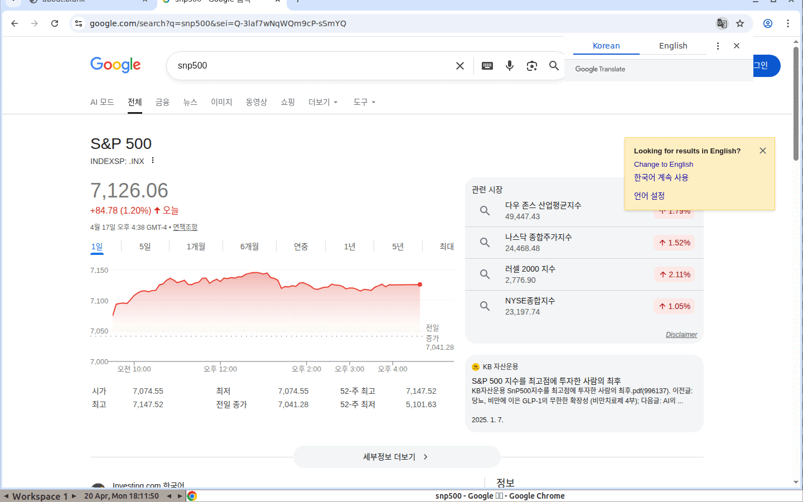

# hermes-computer-use

[](https://github.com/Noah3521/hermes-computer-use/actions/workflows/ci.yml)
[](https://pypi.org/project/hermes-computer-use/)
[](LICENSE)
[](https://www.python.org/)
[](docs/WSL_SETUP.md)

> **Scope: Windows 11 + WSL2 Ubuntu 22.04 / 24.04 only.** See [docs/WSL_SETUP.md](docs/WSL_SETUP.md).

**Pixel-level browser automation MCP server.** Gives any MCP-speaking agent (hermes-agent, Claude Code, Codex, …) 21 tools to drive a real Chrome browser in an Xvfb display — screenshots as vision input, OS-level mouse/keyboard as output. **No CDP. No `navigator.webdriver`. No DOM shortcuts.**

<p align="center"></p>

> **What the GIF shows** — an agent opens Chrome, focuses the Google search bar, types `snp500`, presses Enter, and Google returns a full SERP with the live S&P 500 index card. The same flow routinely trips "unusual traffic" or a captcha for Playwright-driven automation. This stack doesn't get flagged because the browser is stock Chrome driven by stock X11 input — there is no automation fingerprint to detect.

## Why this exists

| | Playwright / CDP | hermes-computer-use |
|---|---|---|
| `navigator.webdriver` | `true` (detectable) | `undefined` |
| CDP endpoint open | yes | no |
| DOM access | direct (fast, brittle to markup changes) | screenshot only (slower, resilient to UI rewrites) |
| Anti-bot footprint | large, constantly patched | near-zero: stock Chrome + stock X input |
| Best for | flows on sites *you own* | agents operating *unfamiliar* sites like a human |

If your automation has to walk a signup funnel on a site guarded by Cloudflare, Kasada, reCAPTCHA, or DataDome, this stack usually passes where Playwright gets stopped.

Evidence: [`docs/assets/demo-sannysoft.png`](docs/assets/demo-sannysoft.png) — [bot.sannysoft.com](https://bot.sannysoft.com) fingerprint panel with `WebDriver`, `Chrome runtime`, `Permissions`, `Plugins`, `Languages`, and `PHANTOM` all **passed**.

## Architecture

```
agent ── stdio MCP ──▶ hermes_computer_use.server ── subprocess ──▶ xdotool / scrot
                                                                        │
                                                                        ▼
                                                                    Xvfb :99
                                                                        │
                                                     ┌──────────────────┼──────────────────┐
                                                     ▼                                     ▼
                                               x11vnc :5900                    websockify + noVNC :6080
                                          (native VNC clients)                 (browser viewer)
```

Longer version: [docs/ARCHITECTURE.md](docs/ARCHITECTURE.md).

## Install

Prerequisites: Windows 11, WSL2 with Ubuntu 22.04/24.04, systemd enabled. Full walkthrough: [docs/WSL_SETUP.md](docs/WSL_SETUP.md).

Everything below runs **inside the WSL shell**.

### From PyPI

```bash
pip install "hermes-computer-use[novnc]"
```

You still need system packages (Xvfb, Chrome, xdotool…) and systemd units — see source install steps 1 & 4.

### From source

```bash
git clone https://github.com/Noah3521/hermes-computer-use.git ~/hermes-computer-use
cd ~/hermes-computer-use

bash scripts/setup.sh                            # 1. apt + Chrome + uinput (sudo)
python3 -m venv .venv && . .venv/bin/activate
pip install -e ".[novnc]"                        # 2. Python package
bash scripts/install-novnc.sh                    # 3. (optional) web viewer

mkdir -p ~/.config/systemd/user                  # 4. persistent services
cp systemd/*.example ~/.config/systemd/user/
# edit the paths inside to match your clone, then:
sudo loginctl enable-linger "$USER"
systemctl --user daemon-reload
systemctl --user enable --now computer-use.service novnc.service
```

Smoke test: `python examples/smoke_test.py`.

## Wire to an MCP client

Copy the relevant snippet from [`config/hermes.yaml.example`](config/hermes.yaml.example) into your agent's MCP server config. Works with hermes-agent, Claude Code, Codex, `mcp-inspector`, or any stdio MCP client.

## Tools (21)

| Category | Tools |
|---|---|
| Status | `screen_info`, `cursor_position` |
| Capture | `screenshot` |
| Pointer | `move`, `left_click`, `right_click`, `double_click`, `middle_click`, `drag`, `scroll` |
| Keyboard | `type_text`, `press_key`, `hold_key` |
| Timing | `wait` |
| Browser | `open_url`, `new_tab`, `close_tab`, `back`, `forward`, `reload` |
| Escape hatch | `run_shell` |

## Demo prompts

Try any of the prompts in [`examples/demo_prompts.md`](examples/demo_prompts.md). The simplest and most illustrative:

> *"Use computer_use to open Google, search for `snp500`, and tell me the current S&P 500 index price from the page."*

Open `http://localhost:6080/vnc.html` in a browser while the agent runs — watching the cursor arc through the search bar is surprisingly compelling.

## Configuration (env vars)

| Var | Default | Meaning |
|---|---|---|
| `CU_DISPLAY` | `99` | X display number |
| `CU_WIDTH` / `CU_HEIGHT` | `1440` / `900` | Virtual screen size |
| `CU_VNC_PORT` | `5900` | x11vnc listen port |
| `CU_STATE_DIR` | `/tmp/hermes-computer-use` | Logs, PID files |
| `CU_PROFILE_DIR` | `$CU_STATE_DIR/chrome-profile` | Persistent Chrome profile |
| `CU_START_URL` | `about:blank` | First URL Chrome opens |
| `CU_INPUT` | `xdotool` | Set to `ydotool` for `/dev/uinput` input |
| `CU_KEY_DELAY_MS` | `25` | Inter-keystroke delay |
| `CU_MOVE_STEPS` | `18` | Cursor interpolation steps |

## Docs

- [WSL_SETUP.md](docs/WSL_SETUP.md) — Windows-side setup, systemd, linger
- [ARCHITECTURE.md](docs/ARCHITECTURE.md) — internals + design rationale
- [CAPTCHA.md](docs/CAPTCHA.md) — what passive / behavioural / visual challenges this approach can and cannot handle
- [TROUBLESHOOTING.md](docs/TROUBLESHOOTING.md) — common failure modes with fixes
- [FAQ.md](docs/FAQ.md) — Playwright comparison, anti-bot honesty, parallel runs, profile safety
- [SECURITY.md](SECURITY.md) — threat model and hardening checklist

## Security

This is an LLM with hands. Read [SECURITY.md](SECURITY.md). Baseline:

- Run in an isolated WSL distro, not your daily driver.
- Strip `run_shell` if the agent doesn't need shell access.
- Don't persist real credentials in `CU_PROFILE_DIR`.

## Contributing

[CONTRIBUTING.md](CONTRIBUTING.md). The thesis is **"emit no abnormal signals" > "emit clever evasions"** — PRs that add CDP, DOM selectors, or anti-detection arms-race patches are out of scope.

## License

MIT. See [LICENSE](LICENSE).

## Acknowledgements

- [anthropic-quickstarts/computer-use-demo](https://github.com/anthropics/anthropic-quickstarts) — the reference loop.
- [x11vnc](https://github.com/LibVNC/x11vnc) + [noVNC](https://github.com/novnc/noVNC) — observer pipeline.
- [Model Context Protocol](https://modelcontextprotocol.io/) — the interface.
